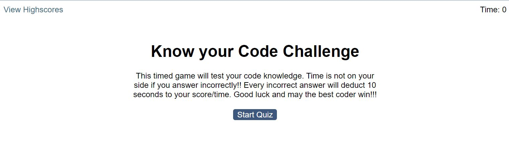

# Code Quiz Challenge

## User Story

A timed quiz that runs in the browser. It is dynamically designed and updated with HTML, CSS and JavaScript.

## Acceptance Criteria

When the user clicks the start button, the timer will start and new questions will appear when answered. If the question is answered incorrectly, the timer will decrement 10 seconds. The code quiz is completed when either all questions are answered or the timer runs out. The scores can be viewed and reset in a separate link/page, "View Highscores."

## Mock-up

## Installation

* Visual Studio Code
* HTML
* CSS
* JavaScript
* Bootstrap

Github: <https://github.com/SarahKubik/CodeQuiz.git>

URL: <https://sarahkubik.github.io/CodeQuizChallenge/>
